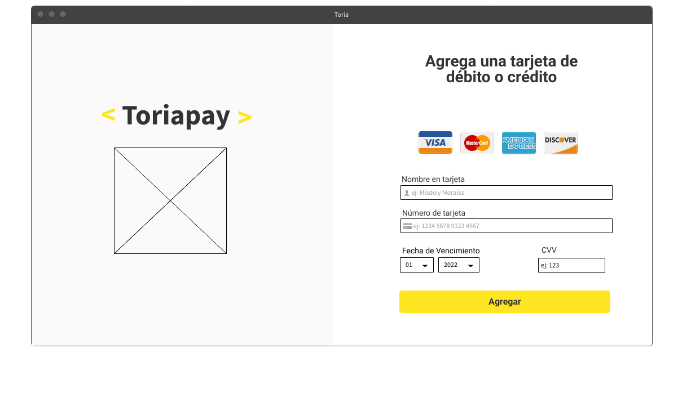

# Validación de tarjeta de crédito para tienda Toria

UI/UX Página 

![Mockup de página] (https://github.com/misdelymorales/SCL021-card-validation/blob/main/src/imagenes/Dise%C3%B1o.png?raw=true)

## Descripción de proyecto

Página de Laboratoria donde se accede a página de pago __Toriapay__ para válidar tarjeta de crédito y continuar con la transacción.

### Construido con
El proyecto fue realizado con los siguientes lenguajes:

* [![HTML][Vue.html]][html-url]
* [![CSS][Vue.js]][css-url]
* [![JavaScript][Vue.js]][JS-url]

## Autor

Realizado por Misdely Morales

<!-- MARKDOWN LINKS & IMAGES -->
<!-- https://www.markdownguide.org/basic-syntax/#reference-style-links -->

[Vue.html]:https://www.stickpng.com/es/img/iconos-logotipos-emojis/companias-technologicas/logo-html5
[HTML-url]:https://html.com/
[Vue.css]: https://pixabay.com/es/illustrations/logo-css-css3-icono-2582747/
[css-url]:https://www.w3.org/Style/CSS/Overview.en.html
[Vue.js]: https://www.pinterest.com/pin/814940495073800533/logo-css-css3-icono-2582747/
[JS-url]:https://www.javascript.com/